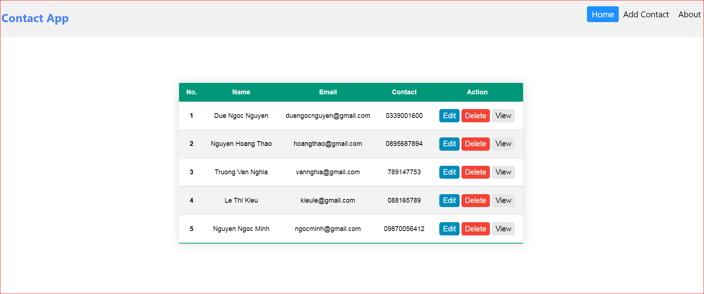

# CRUD react app with FireBase

Create CRUD application using react hooks and FireBase.

## screenshot

---

### **You want to run this app:**

**Step 1:** npm i react

**Step 2 :** npm start

    `yarn start`

**Step 3 :** Open [http://localhost:3000](http://localhost:3000/) to view it in the browser.

The page will reload if you make edits.
You will also see any lint errors in the console.

---

**You can see that app at myHeruko link:** https://crud-databasefirebaseapp.herokuapp.com/
